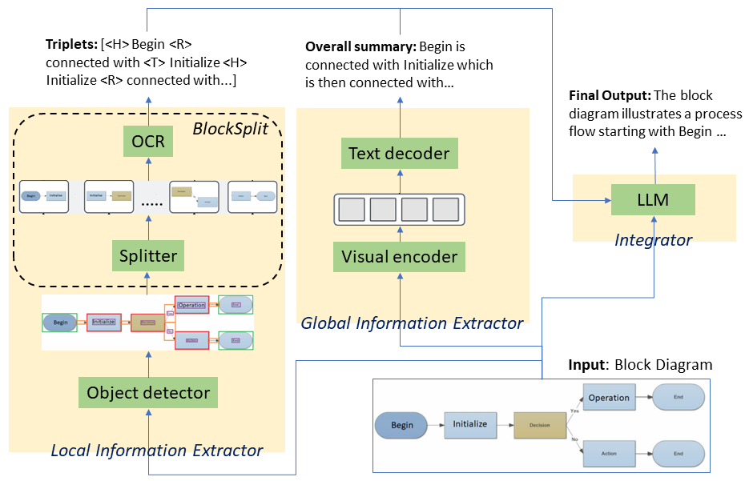

<div align="center">
    
# Unveiling the Power of Integration: Block Diagram Summarization through Local-Global Fusion

[](#how-to-cite)
[](#demo)

**Official Implementation of BlockNet Model**
</div>

## Introduction

BlockNet is an advanced framework designed to summarize block diagrams by integrating local and global information for both English and Korean languages. It employs an OCR-based algorithm that follows a divide-and-conquer principle to extract detailed local information from smaller sections of block diagrams. For global information extraction, it utilizes an OCR-free transformer architecture trained with the BD-EnKo dataset and public data, capturing the overall structure and relationships within the diagrams. By leveraging Large Language Models (LLMs), BlockNet seamlessly synthesizes these detailed and holistic insights to produce coherent and contextually accurate summaries.

<p align="center">
  
</p>

## Pre-trained Models

The links to the pre-trained backbones are here:
- [`local_information_extractor`](https://huggingface.co/shreyanshu09/block_diagram_symbol_detection): This model is trained using an object detection model based on YOLOv5, which offers essential capabilities for detecting various objects in an image. Using the CBD, FCA, and FCB dataset, which includes annotations for different shapes and arrows in a diagram, we train the model to recognize six labels: arrow, terminator, process, decision, data, and text.

- [`global_information_extractor`](https://huggingface.co/shreyanshu09/block_diagram_global_information): This model is trained using a transformer encoder and decoder architecture, based on the configuration specified in [Donut](https://arxiv.org/abs/2111.15664), to extract the overall summary of block diagram images. It supports both English and Korean languages. The straightforward architecture comprises a visual encoder module and a text decoder module, both based on the Transformer architecture.

## Datasets

Sample data from the BD-EnKo dataset is available [here](https://github.com/shreyanshu09/BlockNet/tree/main/BD-EnKo_dataset_sample).

The official implementation of BD-EnKo Dataset and Generator is available in this [GitHub](https://github.com/shreyanshu09/BD-EnKo) repository.


<p align="center">
  
</p>

The links to the datasets are here:

- [`BD-EnKo`](https://huggingface.co/datasets/shreyanshu09/BD-EnKo): 83,394 samples.
- [`Complete Dataset`](https://huggingface.co/datasets/shreyanshu09/Block_Diagram): 84,925 samples.

To generate synthetic datasets with our method, please check [here](https://github.com/shreyanshu09/BD-EnKo) for details.

## Software Installation

### Method 1: With Newer Version of Torch [Recommended]

Follow these steps to set up your environment with a newer version of PyTorch:

1. **Create and activate a new Conda environment:**
    ```bash
    conda create --name blocknet python=3.10 -y
    conda activate blocknet
    ```

2. **Install PyTorch and dependencies:**
    ```bash
    conda install pytorch==2.1.2 torchvision==0.16.2 torchaudio==2.1.2 pytorch-cuda=11.8 -c pytorch -c nvidia
    ```

3. **Install additional Python packages:**
    ```bash
    pip install Pillow==10.1.0
    pip install openai
    pip install chardet
    ```

4. **Clone the Donut repository and install dependencies:**
    ```bash
    git clone -b 1.0.7 https://github.com/clovaai/donut.git
    pip install timm==0.5.4
    pip install transformers==4.21.3
    ```

5. **Install additional utilities:**
    ```bash
    pip install opencv-python
    pip install matplotlib
    pip install seaborn
    pip install wget
    pip install scikit-image
    pip install gradio
    ```

### Method 2: With Older Version of Torch

To set up your environment with an older version of PyTorch, follow these steps:

1. **Clone the BlockNet repository:**
    ```bash
    git clone https://github.com/shreyanshu09/BlockNet.git
    cd BlockNet/
    ```

2. **Create and activate a new Conda environment:**
    ```bash
    conda create -n blocknet python=3.9
    conda activate blocknet
    ```

3. **Install dependencies from `requirements.txt`:**
    ```bash
    pip install -r requirements.txt
    ```

4. **Dependencies versions tested with CUDA 11.8:**
    - [torch](https://github.com/pytorch/pytorch) == 1.12.1 
    - [torchvision](https://github.com/pytorch/vision) == 0.13.1
    - [pytorch-lightning](https://github.com/Lightning-AI/lightning) == 2.1.3
    - [transformers](https://github.com/huggingface/transformers) == 4.21.1
    - [timm](https://github.com/rwightman/pytorch-image-models) == 0.5.4

---

Feel free to choose the method that best suits your requirements. If you encounter any issues, please consult the [official documentation](https://github.com/pytorch/pytorch) or raise an issue on the respective GitHub repositories.

---

## Getting Started

### Data

This repository assumes the following structure of dataset:
```bash
> tree dataset_name
dataset_name

├── train
│   ├── metadata.jsonl
│   ├── {image_path0}
│   ├── {image_path1}
│             .
│             .
└── validation
    ├── metadata.jsonl
    ├── {image_path0}
    ├── {image_path1}
              .
              .

> cat dataset_name/train/metadata.jsonl
{"file_name": {image_path0}, "ground_truth": "{\"gt_parse\": {\"c2t\": \"{ground_truth_parse}\"}}"}
{"file_name": {image_path1}, "ground_truth": "{\"gt_parse\": {\"c2t\": \"{ground_truth_parse}\"}}"}
     .
     .
```

- The structure of `metadata.jsonl` file is in [JSON Lines text format](https://jsonlines.org), i.e., `.jsonl`. Each line consists of
  - `file_name` : relative path to the image file.
  - `ground_truth` : string format (json dumped), the dictionary contains `gt_parse`.

### Training

*Coming soon*


### Inference

Download the pre-trained models and place them in their respective folders:
- [`local_information_extractor`](https://huggingface.co/shreyanshu09/block_diagram_symbol_detection) inside `local_model/block_diagram_symbol_detection`
- [`global_information_extractor`](https://huggingface.co/shreyanshu09/block_diagram_global_information) inside `global_model/block_diagram_global_information`

There are different ways to run the models:


1. **Jupyter Notebook (.ipynb)**:
   - The `all_in_one.ipynb` file contains all the code within a single Jupyter notebook and allows for testing within the notebook.
   - Simply change all the paths and run the cells.

2. **Gradio App**:
   - Open the `app.ipynb` or `app.py` file and update the file paths.
   - Run all the cells.

3. **Python file (.py)**:
   - To run the script, execute the following command in your terminal:

        ```bash
        python main.py image.png --task "Short Description" \
                --lang Korean \
                --api_key "YOUR_API_KEY_HERE"
        ```
    

## Contact

If you have any questions about this work, please contact **[Shreyanshu Bhushan](https://github.com/shreyanshu09)** using the following email addresses: **shreyanshubhushan@gmail.com**.


## License

The content of this project is licensed under the [Attribution-NonCommercial-ShareAlike 4.0 International (CC BY-NC-SA 4.0)](https://creativecommons.org/licenses/by-nc-sa/4.0/).

The BD-EnKo dataset is licensed under the [MIT License](https://mit-license.org/). 
